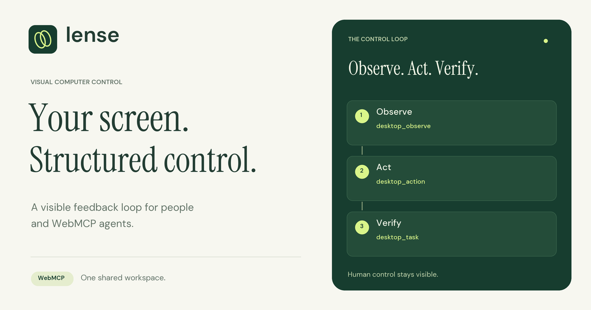

# Lense visual computer control

A Vue control center and portable Windows bridge. The website observes screenshots, asks an evaluator what changed, sends a mouse or keyboard action, and checks the result. The Rust process captures pixels and sends Windows input. It contains no model, shell endpoint, filesystem endpoint, or network proxy.

Production site: [lense-visual-control.netlify.app](https://lense-visual-control.netlify.app).

[Explore the WebMCP tools](https://lense-visual-control.netlify.app/webmcp) or read the [hackathon overview](https://lense-visual-control.netlify.app/hackathon). The [public source repository](https://github.com/bclonan/lense-rs) contains the app and bridge source. Public video: `[YOUTUBE_URL]`, not recorded or published yet. The exact [2:50 recording script](docs/demo-video-script.md) is ready.



The [OSRS field guide](https://lense-visual-control.netlify.app/osrs) has a regional map, searchable visual cues, reusable prompts, and starter skill notes. Add cropped screenshot examples from your own game client. Agents can request one reference at a time through the read-only `osrs_reference` tool. See [the field-guide documentation](docs/osrs-field-guide.md).

The Windows download is paused after Norton quarantined version 1.0.1 as IDP.Generic. There is no approved replacement yet. Keep quarantined copies in quarantine. The browser lab remains available. See the [download status](https://lense-visual-control.netlify.app/bridge-download-status.html) and [review record](docs/antivirus-review.md).

Version 1.0.2 has [Windows setup source and release tooling](docs/windows-setup.md), including Start menu shortcuts and uninstall. The release build still fails at the final EXE write. Norton history records quarantine of that exact output path, and Windows reports no process holding it open. No replacement installer has been built or uploaded. See the [native build diagnosis](docs/native-build-diagnosis.md).

## Quick start

1. Open [Lense](https://lense-visual-control.netlify.app). The **?** button beside the page heading opens instructions for the page you are using. Click it again to hide them.
2. To try Lense without setup, stay in Woodcutting lab and select Run this task. Watch it click trees and recover when a tree disappears.
3. New Windows setup is on hold. The remaining Windows steps describe the flow after an approved bridge release becomes available.
4. Select Detect bridge. Allow the browser's local network connection prompt if it appears. Then select Pair desktop and approve the separate Windows prompt.
5. Choose a window for typing and scrolling, or a monitor for screen-wide observation and clicks. These are the screens and open apps on this computer. No separate keyboard or mouse device selection is needed.
6. Go to desktop controls and check the screenshot. To type, open [the input lab](https://lense-visual-control.netlify.app/input-lab) in a separate visible window, refresh targets, and select that window. Under Mouse, choose a click point inside the editor, then Send click. Under Keyboard, enter text and select Type on desktop.
7. For the built-in desktop demo, open the standalone lab in a separate visible window, select it, and choose Woodcutting Lab autopilot. Other goals need a connected WebMCP agent. Run this task alone does not configure a general AI provider.
8. Pause holds a task. Stop control revokes desktop access. Ctrl+Alt+Escape stops paired sessions from Windows. After refreshing the website, pair again before resuming desktop control.

The current bridge chooses an available reserved local port automatically. Opening the EXE again reports the existing bridge. An older companion can remain open; Lense does not stop other applications.

See the [step-by-step user guide](docs/getting-started.md) for setup and the first complete desktop task.

## Live preview and input

The native preview updates every 0.5 seconds after pairing and target selection. Set Preview interval to 0.25 seconds for faster feedback or Manual to capture on demand. This display refresh does not replace the task's Full check interval or invalidate an agent's last observation ID.

Send an action now sits directly below the preview. Select a window before typing or scrolling. Lense focuses that window before text, shortcuts, clicks, and drags. Mouse has separate click and drag controls. Pick both drag endpoints, choose the duration, and check the result screenshot after sending. Use the input lab for visible text and drawing checks.

Share a screen opens the browser's monitor, window, or tab picker and requests 12 fps video. The agent can read the current shared frame through `desktop_observe`. Browser shares do not identify native input coordinates. Choose Native target, or request `source: "native"`, before targeting clicks or using task/frame action guards.

For fewer tool round trips, send `desktop_action` with `observeAfter: true`. It returns the receipt and a fresh native screenshot after a configurable settle time. An `observationError` means the action succeeded but its follow-up capture failed. Capture again without repeating the input. See [capture and input details](docs/capture-and-input.md).

## Local development

Use Node.js 22.12 or newer and pnpm 10.15.1. The browser lab needs no environment variables, bridge, account, or API key. Rust and Visual Studio C++ build tools are needed only for the Windows bridge.

```powershell
pnpm install --frozen-lockfile
pnpm dev
```

In another terminal:

```powershell
cd bridge
cargo run -- --dev
```

Open the local URL, select Windows desktop, click Detect bridge, then Pair desktop. Approve the native Windows prompt and choose a target. Pairing lasts until disconnection, local emergency stop, or bridge exit.

The browser may also ask for local network permission. The browser permission allows a connection. The separate Windows confirmation grants desktop access.

## WebMCP and documentation

The main app registers seven imperative tools through `document.modelContext.registerTool` when available, with the existing `navigator.modelContext` compatibility check. Browser support is experimental. Use a browser and agent with WebMCP enabled and consult [Chrome's WebMCP documentation](https://developer.chrome.com/docs/ai/webmcp) for current setup. The app detects support; the `/webmcp` inspector reports native registration, local fallback, or a registration error.

Without native WebMCP, the same handlers remain available to developers through `window.lense.tools` and `window.lense.call(name, arguments)`. This fallback does not connect an AI agent. The lab and manual controls still work.

`src/services/webmcp/tools.ts` is the canonical factory. `register.ts` registers its definitions once at the application shell. The `/webmcp` catalog reads those registered definitions, so names, descriptions, and schemas stay in sync. Its read-only runner validates arguments without dynamic code evaluation. Task-changing and input examples open a preview. Native pairing still needs the visible human Pair button and Windows approval.

The `/webmcp` and `/hackathon` pages use the existing app navigation and Pinia stores. Moving between them and Control keeps the same registry and current task. The standalone `/osrs` guide retains its single reference tool; `/lab` and `/input-lab` remain separate test applications.

Set the live site, public repository, and video URL once in `src/site/site-config.json`. `[LIVE_URL]`, `[REPOSITORY_URL]`, and `[YOUTUBE_URL]` are explicit missing values, never completed checklist items. The current live and repository URLs are verified. Replace `videoUrl` with a public HTTPS YouTube URL after recording; the overview then renders a 16:9 player. No API key is needed for the embed.

## Build the portable Windows executable

Use stable Rust with the Windows MSVC toolchain and Visual Studio C++ build tools.

```powershell
cd bridge
cargo test
cargo build --release
```

Output: `bridge/target/release/lense-bridge.exe`. It needs no installer or Tauri window. Double-click it to run the localhost server. Close its console, or press Ctrl+Alt+Escape, to stop native access. The release download is named `LenseBridge-windows-x64.exe`.

Local builds are unsigned unless a release owner signs them. A build or antivirus access-denied failure is not a reason to restore a quarantined file or change protection settings.

The Windows workflow creates review candidates outside public downloads. `./scripts/package-bridge.ps1 -Candidate` records the actual signature state and marks the result `not-approved`. Do not copy workflow candidates into public downloads.

Public packaging requires matching version metadata, build provenance from a clean committed tree, a valid Authenticode signature, and the approved signer's thumbprint through `-ExpectedSignerThumbprint`. Distribution must also be approved in `release/bridge-distribution.json`, with the same certificate thumbprint in `expectedSignerThumbprint`. The site build excludes Windows executables while that policy is paused and checks the package manifest before allowing a release. Signing alone does not resolve Norton's report.

Production trusts `https://lense-visual-control.netlify.app`. Configure a different deployment through `LENSE_PRODUCTION_ORIGIN` at build time or the bridge origin setting documented in [security](docs/security.md). Development origins require `--dev`.

## Try the woodcutting demo

The default Woodcutting lab mode runs in the browser without a bridge or API key. Press Run this task. A pixel evaluator locates a tree, clicks it, observes the chopping indicator, and finds another tree after depletion. Use a 30-second duration for a quick recovery demonstration.

For real desktop input, open `/lab` in a separate visible browser window. Pair Lense, select that window, and choose Woodcutting Lab autopilot in desktop mode. The same evaluator now reads bridge screenshots and clicks through Windows. Keep the selected window visible because the bridge captures visible screen pixels.

The browser demo and native desktop mode are labeled separately. The lab evaluator reads rendered colors and connected tree shapes. It does not read game state or DOM state.

## Type and control other software

Select a native window, observe it, and use the preview click control to focus its editor. Type text from the manual input panel. Hotkeys, scrolling, and dragging are also available through `desktop_action`. `/input-lab` is a disposable typing, drawing, dialog, and scrolling test page.

Arbitrary natural-language desktop tasks need an external WebMCP agent or an `AgentProvider` implementation. The built-in autopilot understands only Woodcutting Lab. Starting an external-agent task records the goal and waits for agent tool calls. It does not pretend that a generic visual model is configured.

Browser JavaScript cannot send arbitrary Windows input. That is why the native bridge is required. Browser screen sharing is an optional observation-only mode.

## Continuous tasks and the queue

Choose Run for, Until complete, or Until stopped. Full checks use an adjustable interval. Cheap native image checks default to one second and can wake the task between full checks. The lab defaults to a two-second full check; external-agent tasks default to five seconds. Slow model calls and browser suspension can delay checks.

Add to queue saves a goal for later. Run queue starts tasks in order. A task advances after completion; Pause, Stop, a failure, or a source change halts the queue. Repeat queue places completed tasks at the end. Reloading restores the queue paused. A continuous task occupies its slot until you stop it or the agent explicitly reports completion with screenshot evidence.

Windows desktop mode includes editable prompts for woodcutting near Lumbridge, banking, skill training, monsters, and quests. Character notes record your chosen game, location, skills, inventory, and objective. These prompts require a connected screenshot-reading WebMCP agent. Lense has no built-in RuneScape planner, live character API, or game error-code integration.

The external agent waits for a screen-change event, a periodic check, or a manual message through `desktop_task`. It then observes, chooses an action, observes the result, and updates context or reports completion. Task and screenshot IDs reject reports from an earlier queue item. See the [agent loop and tool examples](docs/webmcp-tools.md).

## Verify

```powershell
pnpm exec playwright install chromium
pnpm test
pnpm test:release
pnpm test:assets
pnpm build
pnpm test:e2e
```

`pnpm verify` runs all five checks in order. The build includes TypeScript checking. There is no separate lint command. The browser recovery test verifies depletion, recovery, completion, persistence, and export. Documentation tests compare every runtime tool with its card, validate examples and workflows against JSON Schema, check video states, and preserve a running task across navigation. Desktop-input tests use mocks and do not move the developer's real mouse.

Native checks are separate: run `cargo test` from `bridge`. An executable build remains subject to the release restrictions above. Frontend tests do not establish that Windows input works on a real machine.

## Deploy the existing site

`netlify.toml` builds with `pnpm build` and publishes `dist`. It keeps the existing SPA fallback. The build also writes route-specific metadata for `/webmcp` and `/hackathon`, the public license, and the recording script. Windows downloads remain excluded while distribution is paused.

```powershell
pnpm verify
npx netlify-cli status
# On a fresh checkout only, link the existing site:
npx netlify-cli link --id 821ec388-dde0-4043-9b28-ce1e41a72da0
npx netlify-cli deploy --prod --dir dist --no-build
```

Use `npx netlify-cli login` if the status check reports no authentication. Keep tokens out of source control. Check the deployed `/`, `/webmcp`, and `/hackathon` routes and downloads after publishing. Record and upload the demo video separately; this build cannot publish a video for you.

## Project map

| Path | Responsibility |
| --- | --- |
| `bridge/src` | Loopback server, pairing, native input/capture, visual watches |
| `src/types/protocol.ts` | Shared TypeScript wire contracts |
| `src/services/bridge` | Browser permissions, authenticated transport, events |
| `src/services/tasks` | Cancellable task state machine and limits |
| `src/services/evaluator` | Pixel comparison and provider-independent evaluation |
| `src/services/webmcp` | Six desktop tools and read-only OSRS reference lookup |
| `src/pages` | WebMCP explorer, prompt chains, hackathon overview, recording plan |
| `src/site` | Central public URLs and route metadata |
| `src/osrs` | Regional map, visual dictionary, prompts, skill notes, and local screenshot examples |
| `src/stores` | Vue state and task history |
| `src/lab` | Standalone visual application and pixel evaluator |
| `src/components` | Goal, preview, evaluation, replay, and connection UI |
| `tests/e2e` | Browser and mock-bridge acceptance tests |

See [architecture](docs/architecture.md), [protocol](docs/bridge-protocol.md), [security](docs/security.md), [WebMCP tools](docs/webmcp-tools.md), [task engine](docs/task-engine.md), [visual evaluation](docs/visual-evaluation.md), [demo script](docs/demo-script.md), and [troubleshooting](docs/troubleshooting.md).

## Contribute and license

See [CONTRIBUTING.md](CONTRIBUTING.md) for tool, schema, service, prompt, and workflow changes. Lense source and original brand assets use the [MIT license](LICENSE). Bundled fonts retain their [SIL Open Font Licenses](public/fonts/dm-sans-OFL.txt). See [third-party notices](docs/third-party-notices.md) for attribution and reference content.
