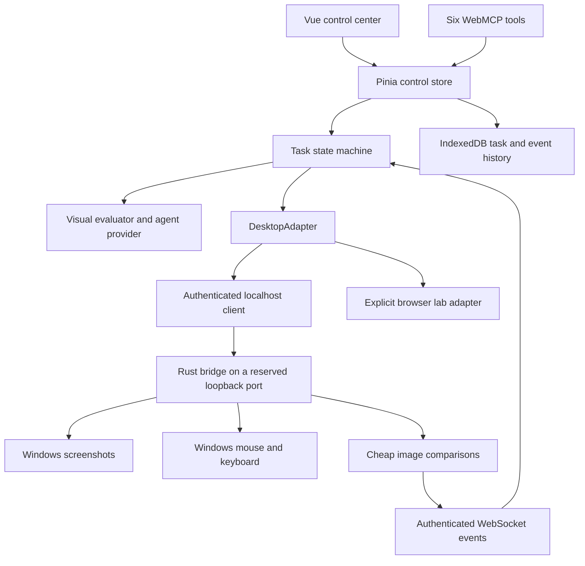

# Architecture

`DesktopAdapter` separates task behavior from transport. Native mode uses `BridgeClient`. The explicit browser demo uses `LabAdapter`. Neither UI controls nor WebMCP tools implement a second action engine.

`AgentProvider` supplies plan, evaluate, and recover methods. The built-in provider recognizes only the lab's visible status color and tree shapes. An external WebMCP agent can use screenshots and issue the same bounded action union for arbitrary applications. Provider secrets do not belong in this static frontend.

The native server owns physical coordinates. Targets identify a monitor or window. A normalized point maps to its current physical bounds, including negative monitor origins. Screen capture and input run with Per-Monitor-V2 DPI awareness.

Native watches capture smaller frames and compare them in Rust. They survive throttled browser timers and push events. The browser must still remain open and connected to evaluate or plan. Closing the browser does not create a hosted background agent.

History contains metadata and bounded image records. Refresh restores history without restarting control. Replay is inspection of recorded events and screenshots, never input re-execution.
